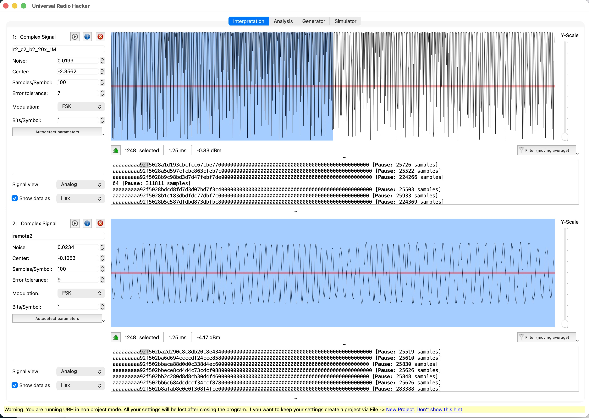

# Novo remote control specification

Frame specification of [Novo D33100 remote](https://en.gznovo.com/transmitter/135.html). Sold in various countries as Maxmarr, Leroy Merlin, Kurlax etc to control blinds. The OEM manufacturer appears to be [Novo](https://en.gznovo.com), [this is the manual](https://en.gznovo.com/uploads/upload/files/20250917/e01c1021ace78fe78c008c64c53a26ed.pdf)

The remote has an elaborate rolling code implementation. It took thousands of recorded button presses and hours of combined Claude Opus and GPT5 to get to this specification and being able to reproduce the frames.

 

## Remotes

This page is based upon analysis of RF broadcasts of:

- Remote 1
  - Maxxmarr-branded skylight blind remote
  - Emits format A, B and C in one broadcast
- Remote 2
  - Novo D33100 purchased from AliExpress
  - can be paired with Maxxmarr skylight blind
  - only emits format A
- Remote 3
  - Novo D33100 purchased from AliExpress
  - only emits format A

Given remote 2 can used to operate the blind we're mostly interested in format A.

Each remote has:

- three buttons 1, 2, 3 to operate the blind and a forth button that selects channel 1-6 or all channels
- in battery compartment button p1 (code) to pair the remote with a blind and button p2 (set) to adjust direction and set limits

## Radio frequency and modulation

- center frequency: 868 MHz, motor responds to 867.8949 MHz - 868.0701 MHz
- deviation: 52 kHz, motor responds to 14 kHz - 150 kHz
- modulation: 2-FSK
- bitrate: 9600 bps

Remote 1, 2, 3 broadcast: lower tone frequency: 867.936 MHz, upper tone frequency: 868.040 MHz, deviation: 52 kHz

## Change protocol of remote

Novo remotes with a small `D` on the bottom left can be configured for different protocols.

While powering on remote:

- hold `up` to select "standard" protocol. This document is about the frames generated in this mode.
- hold `down` to select "low-power" protocol. This one has a lengthy preamble of >600ms and contains a different byte stream. Not investigated.

## Summary

- Frame format A: decoded, 100% documented. 100% reproducable, motor responds to all commands generated using Arduino & CC1101

- Frame format B: decoded, 100% documented. Not yet confirmed: would require device that responds to B only.

- Frame format C: decoded, nearly complete. `c9` low seven bits, `c10`, and `c11` are documented; the remaining unresolved piece is standalone generation of `c9_bit7`. The power-cycle captures suggest Remote 1 starts predictably at `a4 = 0x04` and first clean C state `cc = 0x80`, `c9 = 0x85`. Not yet confirmed on hardware; that would require a device that responds to C only.

---

## Frame formats

1. format A has sync word 0x2f50
2. format B has sync word 0x4bd4, often followed 0x0a, which likely is payload length
3. Format C has sync word 0x25ea, followed by 0x05

Each format has its own [rolling code](https://en.wikipedia.org/wiki/Rolling_code) algoritm.

The first byte after sync word is considered byte 0.

### Format A, sync word 0x2f50

In captures, Format A commonly appears as 4-byte `0xaa` preamble followed by an alignment-looking byte and sync word: e.g. `0xaa aa aa aa a9 2f 50`, then bytes `a0..a10`. The `0xa9` before `0x2f 50` is treated as preamble/bit-alignment, not as part of the Format A payload. Byte numbering starts at zero right after the sync word `0x2f 50`.

Constants:

| Device ID | Byte 1 | Byte 2 | Byte 3 | Phase ID |
|-----------|--------|--------|--------|----------|
| Remote 1  | 0xac   | 0xc5   | 0xc4   |   2      |
| Remote 2  | 0x6a   | 0x1a   | 0x58   |   3      |
| Remote 3  | 0x98   | 0xde   | 0x74   |   1      |

It's unclear how phase id is determined.

| Button            | Byte 1 (a6) | Byte 2 (a7) |
|-------------------|-------------|-------------|
| Button 1 (Open)   | 0x0a        | 0xbc        |
| Button 2 (Stop)   | 0x07        | 0xac        |
| Button 3 (Close)  | 0x13        | 0xe8        |
| P1 / Code (Pair)  | 0x22        | 0xb4        |

| Channel      | Channel Index |
|--------------|---------------|
| Channel 1    |             0 |
| Channel 2    |             1 |
| Channel 3    |             2 |
| Channel 4    |             3 |
| Channel 5    |             4 |
| Channel 6    |             7 |
| All Channels |             5 |

Channel index is a lookup table, not simply `channel - 1`: channel 6 uses index `7`, while all-channels mode uses index `5`. Index `6` has not been observed in any capture and may be reserved or simply an unused position.

#### Observed remote and motor behaviour (Format A)

These are empirical behaviours observed across the captures. They are not part of the byte layout but matter for replay, synthesis, and interpreting the captures.

- **At least two frames per physical press.** A single short button press emits at least two Format A frames, spaced about `12.8 ms` apart (median). The counter `c` still advances `+4` between those two frames (so one press uses `c` and `c+4`). Consecutive presses are separated by a larger gap (median about `132 ms`).

- **Continuous holds stream frames at ~39 frames/sec.** During a held button, frames repeat with a median inter-frame gap of about `25.6 ms` (≈ 39 frames/second). A 30-second hold produces roughly 160–196 frames. Since `c` advances `+4` and wraps every 64 frames, `c` wraps roughly every ~1.6 seconds during a hold.

- **Counter C advances per transmitted frame, not per key press.** This was verified directly (the `+4` step occurs on every frame, including the two frames of a single press), correcting the natural assumption that the counter steps once per button press.

- **Upper-6-bit (`>> 2`) domain for the trailing bytes.** The protocol treats bytes `a8`, `a9`, and `a10` in the upper-6-bit domain. `a9`'s and `a10`'s defined content lives in bits 7..2; the low 2 bits of `a8`/`a9` are effectively don't-care and are never summed into `a10`, the checksum uses each byte's upper 6 bits only.

#### Counters

##### (c) main frame counter

`c` is an 8-bit counter that advances by `+4` per transmitted Format A frame. The `+4` step occurs on every frame, including the two frames of a single press.
Because `c` is an 8-bit counter and advances by `+4`, its lower 2 bits do not change during a counter sequence. Therefore only 64 distinct `c` values are visited before the sequence wraps back to the starting value.

In the two observed Remote 1 power-cycle captures, the first clean Format A counter after power-up was `a4 = 0x04` and `r = 0`.

##### (r) repeat/hold counter

`r` is a conceptual 8-bit repeat/hold counter. For a physical press/hold, it usually starts near 0 and advances by `+4`. In many captures the first effective `r` value is duplicated, so the observed sequence is `0, 0, 1, 2, 3, 4, ...` this while `c` still advances by `+4` causing each frame to be unique.

In the current capture set, short presses average about 2.6 Format A frames, while the five longest single long-press captures average about 163 Format A frames. The largest single long-press capture observed so far contains 196 raw Format A frames, of which 189 decode cleanly.

The lower 6 bits of `r` are encoded in `a8` as `(r & 0x3f) << 2`. Therefore `a8 ^ c` often appears as `0x00, 0x00, 0x04, 0x08, 0x0c, ...`.

The upper 2 bits of `r` are encoded in `a7` by adding them to `cmd2`. Thus `a8 ^ c` wraps every 64 repeat steps, and each wrap increments the hold component in `a7`. High values `0`, `1`, and `2` have been observed in long-hold captures. High value `3` follows naturally from the 8-bit model but has not yet been observed in a capture.

In the current clean captures, non-zero `r >> 6` values were only observed in long-hold captures; short presses normally use `r >> 6 == 0`.

| r range   | low 6 bits | high 2 bits | a8 ^ c             | a7 ^ c   |
| --------- | ---------- | ----------- | ------------------ | -------- |
| 0..63     | 0..63      | 0           | 0x00..0xfc step 4  | cmd2 + 0 |
| 64..127   | 0..63      | 1           | 0x00..0xfc step 4  | cmd2 + 1 |
| 128..191  | 0..63      | 2           | 0x00..0xfc step 4  | cmd2 + 2 |
| 192..255  | 0..63      | 3           | 0x00..0xfc step 4  | cmd2 + 3 |

##### Frame format A specification

| Byte | Value | Description |
| ---- | ----- | ----------- |
| a0 | `0x28 \| ((c & 0x03) ^ phase_id)` | Header/phase byte. High 6 bits are `0x28`; low 2 bits are counter low bits XORed with per-remote `phase_id`. |
| a1 | `c ^ deviceid_byte_1` | Device ID byte 1. |
| a2 | `c ^ deviceid_byte_2` | Device ID byte 2. |
| a3 | `c ^ deviceid_byte_3` | Device ID byte 3. |
| a4 | `c` | Main frame counter byte; advances by `+4` per transmitted frame. |
| a5 | `c ^ (channel_index << 2)` | Channel field via lookup. |
| a6 | `c ^ cmd_byte_1` | Command byte 1. |
| a7 | `c ^ ((cmd2 + ((r >> 6) & 0x03)) & 0xff)` | Command byte 2 plus repeat high bits `r`. |
| a8 | `c ^ ((r & 0x3f) << 2)` | Repeat low bits. Often starts `0, 0, 4, 8, ...` when observed as `a8 ^ c`. |
| a9 | `a9_hi6 = ((c >> 2) + 7) & 0x3f`; `a9 = (a9_hi6 << 2) \| a9_low2` | Counter-derived. _Low 2 bits are unresolved; they are not used by `a10`. Receiver significance is unknown._ |
| a10 | `((sum(x >> 2 for x in [a1,a2,a3,a4,a5,a6,a7,a8,a9]) & 0x3f) << 2)` | 6-bit additive checksum over upper 6 bits of `a1..a9`. `a0` is excluded. |

Do not treat `a9 = (c + 0x1c) & 0xff` as a full-byte formula; only the upper 6 bits of `a9` are currently solved. The low 2 bits are not used by `a10`, and receiver significance is unknown.

##### Frame generate code

The function below returns a complete Format A frame. By default it includes the 2-byte sync word `0x2f50`, followed by bytes `a0..a10`. Pass `include_sync=False` if only the payload after the sync word is needed.

The caller supplies the effective repeat/hold counter `r`. For captures that show the common duplicated first repeat value, a realistic burst generator can use `r = max(0, frame_index - 1)` while computing `c = (c_start + 4 * frame_index) & 0xff`.

```python
def make_format_a_frame(
    remote_id: int,
    button: str,
    channel: int | str,
    c: int,
    r: int,
    a9_low2: int = 0,
    include_sync: bool = True,
) -> bytes:
    """
    Return a valid Format A frame for a Novo D33100-style remote.

    By default the returned bytes are:
        2f 50 a0 a1 a2 a3 a4 a5 a6 a7 a8 a9 a10

    Use include_sync=False to return only the 11-byte payload a0..a10.

    c is the main frame counter byte.
    r is the effective repeat/hold counter byte.
    """

    device_ids = {
        1: (0xac, 0xc5, 0xc4),
        2: (0x6a, 0x1a, 0x58),
        3: (0x98, 0xde, 0x74),
    }

    phase_ids = {
        1: 0x02,
        2: 0x03,
        3: 0x01,
    }

    commands = {
        "open":  (0x0a, 0xbc),
        "stop":  (0x07, 0xac),
        "close": (0x13, 0xe8),
        "p1":    (0x22, 0xb4),
        "pair":  (0x22, 0xb4),
    }

    channel_indices = {
        1: 0,
        2: 1,
        3: 2,
        4: 3,
        5: 4,
        6: 7,
        "all": 5,
    }

    if remote_id not in device_ids:
        raise ValueError(f"unknown remote_id: {remote_id!r}")
    if button not in commands:
        raise ValueError(f"unknown button: {button!r}")
    if channel not in channel_indices:
        raise ValueError(f"unknown channel: {channel!r}")

    c &= 0xff
    r &= 0xff
    a9_low2 &= 0x03

    device_id = device_ids[remote_id]
    phase_id = phase_ids[remote_id]
    cmd1, cmd2 = commands[button]
    channel_index = channel_indices[channel]

    repeat_low = r & 0x3f
    repeat_high = (r >> 6) & 0x03

    a0 = 0x28 | ((c & 0x03) ^ phase_id)
    a1 = c ^ device_id[0]
    a2 = c ^ device_id[1]
    a3 = c ^ device_id[2]
    a4 = c
    a5 = c ^ (channel_index << 2)
    a6 = c ^ cmd1
    a7 = c ^ ((cmd2 + repeat_high) & 0xff)
    a8 = c ^ (repeat_low << 2)

    a9_hi6 = ((c >> 2) + 7) & 0x3f
    a9 = (a9_hi6 << 2) | a9_low2

    checksum6 = sum(x >> 2 for x in [a1, a2, a3, a4, a5, a6, a7, a8, a9]) & 0x3f
    a10 = checksum6 << 2

    payload = bytes([a0, a1, a2, a3, a4, a5, a6, a7, a8, a9, a10])
    if include_sync:
        return bytes([0x2f, 0x50]) + payload
    return payload
```

### Format B, sync word 0x4bd4

Format B has only been observed from Remote 1. Remotes 2 and 3 emit Format A only in the current captures.

In captures, Format B commonly appears as an `aa...` preamble followed by sync `4b d4`, then length byte `0a`, then bytes `b1..b10`:

```text
aa aa ... 4b d4 0a b1 b2 b3 b4 b5 b6 b7 b8 b9 b10
```

For Remote 1 key presses, Format B is typically emitted after the corresponding Format A and Format C frames in the same repeat cycle.

Constants:

| Device ID | Byte 1 | Byte 2 | Byte 3 |
|-----------|--------|--------|--------|
| Remote 1  | 0xab   | 0x31   | 0x71   |

| Command          | Byte 1 | Byte 2 |
|------------------|--------|--------|
| Button 1 (Open)  | 0x02   | 0xaf   |
| Button 2 (Stop)  | 0x01   | 0xeb   |
| Button 3 (Close) | 0x04   | 0xfa   |
| P1 / Code (Pair) | 0x08   | 0xad   |

| Channel      | Channel Index |
|--------------|---------------|
| Channel 1    |             0 |
| Channel 2    |             1 |
| Channel 3    |             2 |
| Channel 4    |             3 |
| Channel 5    |             4 |
| Channel 6    |             7 |
| All Channels |             5 |

Format B uses the same channel-index lookup table as Format A. Unlike Format A, Format B encodes the channel as `c ^ channel_index`; the channel index is not shifted left by 2.

#### Format B Counters

Format B has two counter-like values:

- `c` is the main Format B counter byte and is transmitted directly as `b4`.
- `packet_number` is the repeat number within the current key press and is encoded in `b8` as `b8 = c ^ packet_number`.

In the Remote 1 captures, consecutive Format B frames usually advance `c` by `+3`, modulo 256. This is likely because Remote 1 emits a frame A, C and B in sequence for each repeat cycle, so the underlying radio counter advances for the intervening Format A and Format C frames as well.

The power-cycle captures make the Format A/Format B phase relationship visible. For a clean paired Remote 1 A/C/B cycle, the Format B counter can be derived from the paired Format A counter:

```python
b4 = (ror2(a4) + 2) & 0xff
```

where `ror2(x)` is an 8-bit rotate-right by two bits:

```python
def ror2(x: int) -> int:
    return ((x >> 2) | ((x & 0x03) << 6)) & 0xff
```

This also explains the apparent `+3` Format B step: Remote 1's visible Format A counter advances by `+12`, and rotating/right-shifting that sequence by two bits gives `+3` in the B counter domain. With the observed Remote 1 power-cycle start `a4 = 0x04`, this relation predicts `b4 = 0x03` for the first complete A/C/B cycle. In the Channel 3 power-cycle captures, the first clean B frame observed is usually `b4 = 0x06`, paired with the next clean Format A frame `a4 = 0x10`, so the very first B frame was probably clipped, absent, or hidden by the initial startup artifact.

The decoded `packet_number` starts at 0 for a physical key press and increments by `+1` for each Format B packet in that press; for a normal short press this gives the two values 0 then 1 (matching Format A's two-frames-per-press structure, confirmed via the inter-frame pause pattern). In paired Remote 1 A/B cycles, `packet_number` matches the decoded Format A repeat/hold counter `r` for the paired Format A frame.

No separate Format A-style split repeat/hold counter has been identified for Format B; repeat state is represented by `packet_number` through `b8 = c ^ packet_number`.

For generating standalone Format B frames, the caller can choose any 8-bit `c` and `packet_number`; `b9` and `b10` are derived from the resulting bytes.

For generating a realistic Remote 1 A/C/B burst, derive the Format B counter and packet number from the paired Format A state:

```python
a4 = (a4_start + 12 * frame_index) & 0xff
c = (ror2(a4) + 2) & 0xff
packet_number = r
```

where `a4_start = 0x04` matches the observed Remote 1 power-cycle start, and `r` is the decoded/generated Format A repeat counter for that same repeat cycle.

#### Frame B format specification

| Byte | Value                | Description                          |
|------|----------------------| -------------------------------------|
| b0   | `0x0a`               | length                               |
| b1   | `c ^ deviceid_byte_1`| device ID 1                          |
| b2   | `c ^ deviceid_byte_2`| device ID 2                          |
| b3   | `c ^ deviceid_byte_3`| device ID 3                          |
| b4   | `c`                  | main Format B counter                |
| b5   | `c ^ channel_index`  | channel                              |
| b6   | `c ^ cmd_byte_1`     | command byte 1                       |
| b7   | `c ^ cmd_byte_2`     | command byte 2                       |
| b8   | `c ^ packet_number`  | packet repeat number within keypress |
| b9   | `(c + 0x07) & 0xff`  | counter + offset                     |
| b10  | `sum(b1..b9) & 0xff` | checksum, excludes b0 length         |

The Format B checksum formula `sum(b1..b9) & 0xff` matched all clean decoded Format B frames in the analyzed capture set. It excludes `b0` (the length byte): summing `b0..b9` instead matches 0 frames, confirming `b0` is not included. The `b9 = (c + 0x07)` formula matched 833/856 frames; the failures are the usual deterministic URH glitches (data-dependent, reproducible), not a flaw in the formula.

##### Frame B generate code

The function below returns a complete Format B frame. By default it includes the 2-byte sync word `0x4bd4`, followed by bytes `b0..b10`. Pass `include_sync=False` if only the payload after the sync word is needed.

```python
def make_format_b_frame(
    button: str,
    channel: int | str,
    c: int,
    packet_number: int,
    include_sync: bool = True,
) -> bytes:
    """
    Return a valid Format B frame for Remote 1.

    By default the returned bytes are:
        4b d4 b0 b1 b2 b3 b4 b5 b6 b7 b8 b9 b10

    Use include_sync=False to return only the 11-byte payload b0..b10.

    c is the main Format B counter byte.
    packet_number is the per-keypress repeat number encoded through b8.
    """

    device_id = (0xab, 0x31, 0x71)

    commands = {
        "open":  (0x02, 0xaf),
        "stop":  (0x01, 0xeb),
        "close": (0x04, 0xfa),
        "p1":    (0x08, 0xad),
        "pair":  (0x08, 0xad),
    }

    channel_indices = {
        1: 0,
        2: 1,
        3: 2,
        4: 3,
        5: 4,
        6: 7,
        "all": 5,
    }

    if button not in commands:
        raise ValueError(f"unknown button: {button!r}")
    if channel not in channel_indices:
        raise ValueError(f"unknown channel: {channel!r}")

    c &= 0xff
    packet_number &= 0xff

    cmd1, cmd2 = commands[button]
    channel_index = channel_indices[channel]

    b0 = 0x0a
    b1 = c ^ device_id[0]
    b2 = c ^ device_id[1]
    b3 = c ^ device_id[2]
    b4 = c
    b5 = c ^ channel_index
    b6 = c ^ cmd1
    b7 = c ^ cmd2
    b8 = c ^ packet_number
    b9 = (c + 0x07) & 0xff
    b10 = sum([b1, b2, b3, b4, b5, b6, b7, b8, b9]) & 0xff

    payload = bytes([b0, b1, b2, b3, b4, b5, b6, b7, b8, b9, b10])
    if include_sync:
        return bytes([0x4b, 0xd4]) + payload
    return payload
```

### Format C, sync word 0x25ea

Format C has only been observed from Remote 1. Remotes 2 and 3 emit Format A only in the current captures.

For Remote 1 key presses, Format C is typically emitted between the corresponding Format A and Format B frames in the same repeat cycle.

In captures, Format C commonly appears as a `55...` preamble followed by sync `25 ea`, then twelve payload bytes labelled `c0..c11`:

```text
55 55 ... 25 ea c0 c1 c2 c3 c4 c5 c6 c7 c8 c9 c10 c11
```

`c0` is always `0x05`. `c1..c11` are the XOR-encoded payload bytes described below. Like Format A, the payload is twelve bytes total: one fixed prefix plus eleven encoded bytes.

Constants:

Format C uses the same channel-index lookup table as Format A and Format B.

| Channel      | Channel Index | Group `g = channel_index >> 1` | Odd bit `channel_index & 1` |
|--------------|---------------|--------------------------------|-----------------------------|
| Channel 1    |             0 |                              0 |                           0 |
| Channel 2    |             1 |                              0 |                           1 |
| Channel 3    |             2 |                              1 |                           0 |
| Channel 4    |             3 |                              1 |                           1 |
| Channel 5    |             4 |                              2 |                           0 |
| Channel 6    |             7 |                              3 |                           1 |
| All Channels |             5 |                              2 |                           1 |

The identity bytes are group-dependent constants XORed with the Format C counter byte `cc`:

| Group `g` | Channels       | `c2 ^ cc` | `c3 ^ cc` | `c4 ^ cc` |
|-----------|----------------|-----------|-----------|-----------|
| 0         | Channel 1 / 2  | `0x98`    | `0xb8`    | `0x80`    |
| 1         | Channel 3 / 4  | `0x99`    | `0xb9`    | `0x81`    |
| 2         | Channel 5 / All Channels | `0x9a` | `0xba` | `0x82` |
| 3         | Channel 6      | `0x9b`    | `0xbb`    | `0x83`    |

The `c6` channel/button field is encoded as `c6 = cc ^ channel_button_code`.

The high bit of `channel_button_code` is the odd/even channel bit:

```python
channel_button_code = ((channel_index & 1) << 7) | low_button_code
```

The low button code depends on button and group:

| Button            | Formula          | g=0 | g=1 | g=2 | g=3 |
|-------------------|------------------|-----|-----|-----|-----|
| Button 1 (Open)   | `(1 - g) % 4`    | `1` | `0` | `3` | `2` |
| Button 2 (Stop)   | `g % 4`          | `0` | `1` | `2` | `3` |
| Button 3 (Close)  | `(2 + g) % 4`    | `2` | `3` | `0` | `1` |
| P1 / Code (Pair)  | `4 + g`          | `4` | `5` | `6` | `7` |

The `c7` command field is encoded as `c7 = cc ^ cmd1`:

| Button            | Formula     | g=0    | g=1    | g=2    | g=3    |
|-------------------|-------------|--------|--------|--------|--------|
| Button 1 (Open)   | `0x57 ^ g`  | `0x57` | `0x56` | `0x55` | `0x54` |
| Button 2 (Stop)   | `0xf5 ^ g`  | `0xf5` | `0xf4` | `0xf7` | `0xf6` |
| Button 3 (Close)  | `0x7d ^ g`  | `0x7d` | `0x7c` | `0x7f` | `0x7e` |
| P1 / Code (Pair)  | `0x56 ^ g`  | `0x56` | `0x57` | `0x54` | `0x55` |

#### Format C Counters

Format C has at least one counter-like byte:

- `cc` is the main Format C counter byte and is transmitted directly as `c5`.
- `c1` is also counter-derived, but only from the low seven bits of `cc`: `c1 = (cc & 0x7f) ^ (0x55 ^ g)`. This keeps the high bit of `c1` clear in the clean captures.
- The Format C counter is independent from the Format A counter value. Remote 1 emits Format A, then Format C, then Format B in the same repeat cycle, but the decoded counter bytes are not the same across the three formats.
- `c8` appears to contain a repeat/secondary-command component. For short presses its base value is predictable from the button and group. During longer holds it may change, but the hold behaviour is not yet characterised as fully as Format A.
- `c9` is a counter with a persistent phase bit. Its low seven bits are fully solved — derived from the unwrapped Format A counter `c_A_ext` from the paired Format A frame in the same A/C/B cycle:

  ```
  c9_low7 = ((c_A_ext >> 3) + 4) & 0x7f
  c9 = (c9_bit7 << 7) | c9_low7
  ```

  `c_A_ext` means the monotonic/unwrapped version of Format A's `a4` counter, not just the transmitted 8-bit byte. If only the 8-bit `a4` byte is available, then `c9` bits 5..6 require tracking the wrap/phase state across frames.

  The new power-cycle captures suggest the low-seven-bit state is reproducible after power-on. In both Channel 3 / Button 1 power-cycle rounds, the first clean Format C frame after the initial partial artifact starts from the same state (`a4 = 0x04`, `cc = 0x80`, `c9 = 0x85`).

  Both power-cycle rounds also contain a reproducible non-standard/partial-looking `25ea` fragment immediately before that first clean Format C frame. It has Format-C-like group bytes but does not satisfy the normal command/checksum interpretation, so it should be treated as a startup artifact or special first-use fragment rather than as an ordinary Format C frame until understood.

  The high bit of `c9` is still not derived from first principles. It is coupled to `c11`'s bit 7:

  ```
  c11_bit7 = (~c9_bit7) ^ (channel_index & 1) ^ button_flag
  c9_bit7  = (~c11_bit7) ^ (channel_index & 1) ^ button_flag
  ```

  Because `c9_bit7` is stateful, a byte-perfect synthetic Format C generator needs one of:

  - a single captured reference frame from the target remote (to learn its current phase), then track `c9` forward per frame, **or**
  - the power-on phase value, then track forward.

  Both are the standard approach for cloning any rolling-code remote. With a supplied or tracked `c9`, the generator reproduces every byte of every non-corrupted captured frame (see reproduction results below).

  Per-frame, `c9_low7` advances by 1 or 2 each Format C frame. The split is driven by the Format A counter: when `c_A_ext & 7 < 4`, the next frame's `c9_low7` advances by 1; when `c_A_ext & 7 >= 4`, it advances by 2. This is the natural consequence of the Format A counter stepping by 12 per A/C/B cycle and the `>> 3` in the formula.
- `c10` is a checksum byte. Its bit 7 always matches `c2`'s bit 7. Its low seven bits are derived from the low seven bits of `c1..c9` plus a correction term that uses the high bits of those bytes and the high bit of `c11`. The folded-high-bit formula is given in full in the helper code below; it matches 100% of captured frames.
- `c11` is a phase byte. Specifically, `c11 = 0x80` when `(~c9_bit7) XOR (channel_index & 1) XOR button_flag` is 1, and `c11 = 0x00` otherwise. The `button_flag` is `0` for Button 1 (Open) and P1, and `1` for Button 2 (Stop) and Button 3 (Close). This formula matches every non-corrupted captured frame. `c11` only ever carries bit 7; the low 7 bits are always zero. A spurious bit 6 (`0x40`/`0xc0`) appears in 24 of 2,828 frames (~0.85%), scattered across all channels/buttons/counters with no state correlation, and 20 of those 24 also fail the `c10` checksum — these are single-bit reception errors, not a protocol field. (The `c10` checksum reads only `c11` bit 7, so a flipped bit 6 slips past a frame's own self-check, which is why the remaining 4 look "self-consistent".)

For short presses, the observed base value for `c8 ^ cc` is:

| Button            | `c8 ^ cc` base |
|-------------------|----------------|
| Button 1 (Open)   | `0x80 + g`     |
| Button 2 (Stop)   | `0x80 + g`     |
| Button 3 (Close)  | `0x00 + g`     |
| P1 / Code (Pair)  | `0x80 + g`     |

The hold/repeat model observed in the current captures is:

```python
if button == "close":
    c8_base = g
else:
    c8_base = 0x80 + g

c8 = cc ^ (c8_base ^ repeat_c)
```

For short-press captures, `repeat_c` is normally `0`. During holds, `repeat_c` advances as a clean incrementing counter (`0x00, 0x01, 0x02, ...`, often with each value duplicated across the two frames of a repeat step) while the frame counters continue advancing. `repeat_c` is recovered from a captured frame as `repeat_c = c8 ^ cc ^ c8_base`. Across all clean captures, 1,263 frames have `repeat_c == 0` (short presses) and 1,565 have `repeat_c != 0` (holds); the hold frames are fully explained by this counter, not by any unknown in `c8`.

#### Format C reproduction results

Against the full clean-capture set (2,828 paired Remote 1 Format C frames), the generator below — supplied with the real `c9` and `repeat_c` for each frame — reproduces:

- **2,779 / 2,828 = 98.27%** of all clean-group frames byte-for-byte, and
- **2,779 / 2,783 = 99.86%** of frames that pass their own `c10` checksum (i.e. were not corrupted in reception).

Of the 49 residual mismatches, 45 fail their own `c10` checksum outright (reception glitches) and the remaining 4 differ only in `c11` bit 6, the single-bit RX error described above. In other words, on every frame that arrived intact, the specification is byte-perfect given the tracked `c9` and `repeat_c` state.

#### Frame C format specification

Fields `c0..c8`, `c10`, and `c11` are fully solved for the observed short-press and hold captures. `c9`'s low seven bits are solved (derived from the unwrapped paired Format A counter). `c9_bit7` is not an unsolved formula but irreducible persistent phase state, retained across power cycles and coupled to `c11`; generating Format C from scratch requires a captured or tracked phase, exactly as for any rolling-code remote. Every field of every non-corrupted captured frame is understood, and the generator reproduces intact frames byte-for-byte given the tracked `c9`/`repeat_c` state.

| Byte | Value | Description |
|------|-------|-------------|
| c0  | `0x05` | Fixed byte immediately after sync `0x25ea`. |
| c1  | `(cc & 0x7f) ^ (0x55 ^ g)` | Counter/group-derived byte. High bit is clear in clean captures. |
| c2  | `cc ^ (0x98 + g)` | Group-dependent identity byte 1. |
| c3  | `cc ^ (0xb8 + g)` | Group-dependent identity byte 2. |
| c4  | `cc ^ (0x80 + g)` | Group-dependent identity byte 3. |
| c5  | `cc` | Main Format C counter byte. |
| c6  | `cc ^ channel_button_code` | Channel and button field. High bit is the odd/even channel bit; low bits identify button within group. |
| c7  | `cc ^ cmd1` | Command byte 1. |
| c8  | `cc ^ (c8_base ^ repeat_c)` | Repeat/secondary-command field. Short presses normally use `repeat_c = 0`; holds use the observed duplicated repeat sequence. |
| c9  | counter + phase state (see below) | Low seven bits = `((c_A_ext >> 3) + 4) & 0x7f` from the unwrapped paired Format A counter. Bit 7 is irreducible phase state (retained across power cycles, coupled to `c11` bit 7) — supply it from a captured reference or track it forward; it cannot be computed standalone. |
| c10 | folded-high-bit checksum of `c1..c9` (see helper code) | Bit 7 matches `c2`'s bit 7. Low 7 bits derived from low 7 bits of `c1..c9` plus a correction using their high bits and `c11`'s high bit. |
| c11 | `0x80` if `(~c9_bit7) ^ (channel_index & 1) ^ button_flag` else `0x00` | Phase byte. `button_flag = 0` for OPEN/PAIR, `1` for STOP/CLOSE. |

##### Frame C helper code

The function below returns a complete Format C frame for the given button, channel, counter, and `c9`. The caller supplies `c9` because `c9_bit7` is persistent phase state (see above), not a value derivable from the other fields. If the unwrapped paired Format A counter and the desired high-bit phase are known, `c9` can be constructed as `((c9_bit7 << 7) | (((c_A_ext >> 3) + 4) & 0x7f))`; otherwise copy `c9` from a matching captured frame or track it forward from a known previous `c9` state. Given the real `c9` and `repeat_c`, this function reproduces every non-corrupted captured frame byte-for-byte (99.86% of self-consistent frames; the rest are reception glitches).

By default the returned bytes are:

```text
25 ea c0 c1 c2 c3 c4 c5 c6 c7 c8 c9 c10 c11
```

```python
def make_format_c_frame(
    button: str,
    channel: int | str,
    cc: int,
    c9: int,
    repeat_c: int = 0,
    include_sync: bool = True,
) -> bytes:
    """
    Return a complete Format C frame for the given button, channel, and counter.

    c9 must be supplied by the caller. Its low 7 bits can be computed from
    the unwrapped paired Format A counter, but c9 bit 7 is still a phase value
    that must be copied, supplied, or tracked from a known previous state.
    """

    channel_indices = {
        1: 0,
        2: 1,
        3: 2,
        4: 3,
        5: 4,
        6: 7,
        "all": 5,
    }

    if channel not in channel_indices:
        raise ValueError(f"unknown channel: {channel!r}")

    cc &= 0xff
    c9 &= 0xff
    repeat_c &= 0xff

    channel_index = channel_indices[channel]
    g = channel_index >> 1
    odd = channel_index & 1

    low_button_codes = {
        "open":  (1 - g) % 4,
        "stop":  g % 4,
        "close": (2 + g) % 4,
        "p1":    4 + g,
        "pair":  4 + g,
    }

    cmd1_values = {
        "open":  0x57 ^ g,
        "stop":  0xf5 ^ g,
        "close": 0x7d ^ g,
        "p1":    0x56 ^ g,
        "pair":  0x56 ^ g,
    }

    if button not in low_button_codes:
        raise ValueError(f"unknown button: {button!r}")

    if button == "close":
        c8_base = g
    else:
        c8_base = 0x80 + g

    channel_button_code = (odd << 7) | low_button_codes[button]
    cmd1 = cmd1_values[button]

    c0 = 0x05
    c1 = (cc & 0x7f) ^ (0x55 ^ g)
    c2 = cc ^ (0x98 + g)
    c3 = cc ^ (0xb8 + g)
    c4 = cc ^ (0x80 + g)
    c5 = cc
    c6 = cc ^ channel_button_code
    c7 = cc ^ cmd1
    c8 = cc ^ (c8_base ^ repeat_c)

    # c11 phase byte: depends on c9 bit 7, channel odd bit, and button
    button_flag = 1 if button in ("stop", "close") else 0
    c9_bit7 = (c9 >> 7) & 1
    c11 = 0x80 if ((c9_bit7 ^ 1) ^ odd ^ button_flag) else 0x00

    # c10 folded-high-bit checksum of c1..c9.
    # Bit 7 of c10 matches bit 7 of c2.
    # Low 7 bits = sum of low 7 bits of c1..c9, plus a correction term that
    # folds in the number of high bits set across c1..c9 together with c11's
    # high bit.
    xs = [c1, c2, c3, c4, c5, c6, c7, c8, c9]
    low7_sum = sum(x & 0x7f for x in xs)
    high_bit_count = sum((x >> 7) & 1 for x in xs)
    c11_bit = (c11 >> 7) & 1
    c10_low7 = (low7_sum + ((high_bit_count + (1 - c11_bit)) // 2)) & 0x7f
    c10 = (c2 & 0x80) | c10_low7

    payload = bytes([c0, c1, c2, c3, c4, c5, c6, c7, c8, c9, c10, c11])
    if include_sync:
        return bytes([0x25, 0xea]) + payload
    return payload
```

### Miscellaneous observations

- **Remote 1 visible Format A frames advance by `+12`.** Remote 1 emits Format A, then Format C, then Format B in each repeat cycle. The underlying counter still advances by `+4` per transmitted frame, but because two other formats are transmitted between visible Format A frames, the observed Format A `a4` sequence on Remote 1 advances by `+0x0c`. Format-A-only remotes show the direct `+4` step between visible Format A frames.

- **The motor tolerates counter rollover / is not strict-monotonic.** In long holds, `c` wraps past `0xff -> 0x00` multiple times and the motor keeps responding. The receiver therefore does NOT reject a counter value that is lower than the previously seen one (it is not a strict rolling-code/anti-replay check). This is the key behaviour that makes simple replay viable: a captured frame does not become permanently "spent", and precise counter management is not required to be accepted.

## Captured frames

The captures in [frame captures.txt] were recorded using rtl_sdr and demodulated and decoded with URH to analyse the broadcasted frames and encoding used.

## Open questions

The following is not 100% understood:

- Format A: How Phase ID relates to Device ID. Likely it's derived from Device ID but has not been validated. In case of adding a new Device ID its phase ID has to be added as well.
- Frame B: frame format is 100% decoded and matches all captures frames, empirically. But it has not yet validated against a blind motor.
- Frame C: Not 100% decoded, a few bits unclear..
- Button P2 unclear: observation using P2 changes the whole format of A, B and C. Given P2 is involved in configuring a blind we do not have to understand this one.
- Some Novo remote variants have more buttons.. probably easy to determine their values but would require rf captures.

## Contribute data

I'd love to receive more samples to determine more device id and phase_id relationship. How to make a usefull capture:

1. Start `rtl_sdr -f 868000000 -g 20 -s 1000000 recording-1Ms.cu8`
2. Open the `cu8` file in URH and select `Show data as Hex` and and share the hex stream.

    A succesfull capture should look like this in URH: 

    It has the 0x2f50 preamble which means this is a broadcast of frame A.

